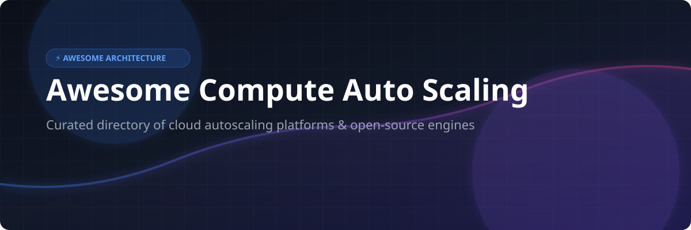

# Awesome-Compute-Auto-Scaling

# Awesome-Compute-Auto-Scaling ⚙️ 📈



  





  
  
  
  
  
  



---

## 🌟 Top Compute Auto Scaling Ecosystem

**Curated List of Commercial Auto Scaling Platforms & Open-Source Autoscaling Tools**  
*Focused on Dynamic Capacity Management, Predictive Scaling, Kubernetes Autoscaling, Rightsizing & Self-Hosted Autoscaling Engines*

**Last updated: October 2026** 📅

---

### 📌 Overview & SEO Summary
Welcome to the ultimate curated directory of **compute auto scaling platforms**, **open-source autoscaling frameworks**, and **capacity optimization engines**. Whether you are looking for enterprise-grade commercial solutions (such as *AWS EC2 Auto Scaling*, *Azure VMSS*, and *Spot by NetApp*), or self-hostable open-source alternatives (like *KEDA*, *VPA*, and *Cluster Autoscaler*), this list covers category leaders, predictive scaling, and privacy-respecting capacity management.

**Key Market Context:**
- **Auto scaling is essential for cost efficiency** — cloud providers charge only for what you use, making dynamic scaling the primary mechanism for aligning capacity with demand .
- **Native auto scaling services are free** — AWS, Azure, and GCP charge nothing for the autoscaling service itself; you pay only for the underlying compute resources .
- **Kubernetes-native autoscaling** (KEDA, VPA, Cluster Autoscaler) has become the standard for container workloads, with **KEDA achieving CNCF Graduation**.

---

## 📑 Table of Contents
- [🏢 SaaS & Commercial Platforms](#-saas--commercial-platforms)
- [🔓 Open-Source GitHub Projects](#-open-source-github-projects)
- [🛠️ How to Contribute](#%EF%B8%8F-how-to-contribute)
- [📊 Star History](#-star-history)
- [🤝 Support & Sponsorship](#-support--sponsorship)
- [⚠️ Disclaimer](#%EF%B8%8F-disclaimer)

---

## 🏢 SaaS / Commercial Platforms

The compute auto scaling market spans **hyperscaler native services** (AWS EC2 Auto Scaling, Azure VMSS, GCP MIG) that provide **free autoscaling with deep ecosystem integration**, and **specialized optimization platforms** (Spot by NetApp, Cast AI, Turbonomic) that offer **predictive scaling, rightsizing, and multi-cloud capacity management**. **AWS EC2 Auto Scaling** is **free** — you pay only for the EC2 instances used . **Azure Virtual Machine Scale Sets** are **free** — you pay only for the underlying VMs, storage, and networking . **Google Compute Engine MIGs** are **free** — you pay only for the Compute Engine instances . **Spot by NetApp** has a **median buyer cost of $109,384/year** . **Cast AI** charges **$1,000/month for Growth (up to 2,000 CPUs)** or **$5,000/month for Enterprise** . **IBM Turbonomic** starts at **$18.75/month for Cloud** or **$225/year usage-based for Standard** .

| SaaS / Commercial Platform | Company / Owner | Valuation / Market Cap | Standard Edition Starting Price | Free Tier / Free Trial Limits | Description |
| :--- | :--- | :--- | :--- | :--- | :--- |
| **[AWS EC2 Auto Scaling](https://aws.amazon.com/ec2/autoscaling/)** ☁️ | Amazon | ~$2.0 Trillion | **Free service**; pay only for EC2 instances used  | **Free forever** | **AWS-native auto scaling** — **Dynamic scaling** based on CloudWatch metrics, schedules, or predictive policies. **Step scaling** allows different adjustments based on alarm breach size (e.g., +10 instances at 60%, +30 at 75%) . **Spot Instances** with capacity-optimized allocation. **Warm pools** for faster scale-out. |
| **[Azure Virtual Machine Scale Sets](https://azure.microsoft.com/en-us/products/virtual-machine-scale-sets/)** 🔷 | Microsoft | ~$3.90 Trillion | **Free service**; pay for VMs, storage, networking  | **Free forever** | **Azure-native auto scaling** — **Scheduled and metric-based scaling** with CPU, network, and disk metrics . **Automatic distribution across Availability Zones** for high availability. **Up to 1,000 VMs per scale set** . **Autoscale rules** with configurable min/max limits. |
| **[Google Compute Engine MIGs](https://cloud.google.com/compute/docs/autoscaler)** 🌐 | Google (Alphabet) | ~$2.0 Trillion | **Free service**; pay for Compute Engine instances  | **Free forever** | **GCP-native auto scaling** — **Target utilization metrics** (CPU, HTTP load balancing, Cloud Monitoring) and **schedule-based scaling** . **Up to 128 scaling schedules per MIG**. **Predictive autoscaling** with initialization period . **Scale to zero** with minNumReplicas=0. |
| **[Spot by NetApp](https://spot.io/)** 🟢 | NetApp / Flexera | ~$20 Billion | **Median buyer: $109,384/year** (range $13.5K–$191K)  | **Freemium · Self-serve signup**  | **Cloud automation and optimization** — **Continuous analytics** for infrastructure optimization. **Spot instance management** with interruption prediction. **Ocean** for Kubernetes worker node management. **Savings-based billing** aligns fees with achieved value. |
| **[Cast AI](https://cast.ai/)** 🎯 | Cast AI | Private | **Growth: $1,000/month** (up to 2,000 CPUs); **Enterprise: $5,000/month**  | **Free (Monitoring): unlimited clusters, read-only** | **Kubernetes automation** — **Automated cluster autoscaling** with continuous rebalancing, container live migration, and workload right-sizing . **Consumption unit: $0.01 per overage**. **Realized savings** tracked via node autoscaler and workload autoscaler. |
| **[IBM Turbonomic](https://www.ibm.com/products/turbonomic)** ⚙️ | IBM | ~$200 Billion | **Cloud: $18.75/month**; **Standard: $225/year usage-based**  | **30-day free trial** with unlimited optimization  | **Application resource management** — **Public cloud optimization**, **Kubernetes optimization** (EKS, AKS, GKE), and **application/database resource optimization** . **SLO-driven optimization** and **enterprise SSO**. **Percentage of cloud spend or per MVS** pricing for larger deployments . |
| **[Densify](https://www.densify.com/)** 📊 | Densify | Private | **Custom enterprise pricing** | **Demo available** | **Cloud and container optimization** — **Optimization-as-code** with ML technology. **AWS, Azure, GCP, and Kubernetes analysis APIs** . **Container recommendations** per cluster. Makes applications **self-aware of precise resource requirements**. |
| **[Granulate](https://granulate.io/)** ⚡ | Intel (Acquired) | ~$100 Billion (Intel) | **Custom enterprise pricing** | **Demo available** | **Autonomous workload optimization** — **No code changes required**. Continuous ML-driven CPU and memory tuning. |
| **[Kubecost](https://www.kubecost.com/)** 💰 | IBM (Kubecost) | Private | **Free tier: unlimited clusters, 250 cores or $100K spend** | **Free: EKS-optimized bundle with no spend cap**  | **Kubernetes cost monitoring** — **Real-time cost allocation** by cluster, node, namespace, controller, service, or pod . **EKS-optimized bundle is free** with full Kubernetes spend features, no $100K cap . **Savings recommendations** for rightsizing. |
| **[Morpheus Data](https://morpheusdata.com/)** 🔮 | Morpheus Data | Private | **Quote-based, custom pricing**  | **Demo available** | **Cloud management platform** — **Self-service provisioning with policy guardrails**. **Custom pricing engine** with USN currency support for chargeback . **Cloud costing analytics** and billing reports . |

---

## 🔓 Open-Source GitHub Projects

*Sorted by GitHub_Stars_Count (Descending)* 🌟

- **[KEDA](https://github.com/kedacore/keda)**   
  **Kubernetes Event-driven Autoscaling**, Apache-2.0 licensed. **CNCF Graduated project** — the **de facto standard for event-driven autoscaling** in Kubernetes. **Scale-to-zero** for event-driven workloads. **50+ built-in scalers** for Cron, CPU, External, MQ, DB, and more. **No external dependencies** — runs on cloud and edge. Integrates natively with **Horizontal Pod Autoscaler (HPA)**. 🎯

- **[Cluster Autoscaler](https://github.com/kubernetes/autoscaler/tree/master/cluster-autoscaler)**   
  **Kubernetes cluster scaling**, Apache-2.0 licensed. **Automatically adjusts cluster size** when pods fail to schedule or nodes are underutilized. **Works with AWS, Azure, GCP, and other providers**. **The foundational cluster autoscaler** for Kubernetes. ⚙️

- **[VPA (Vertical Pod Autoscaler)](https://github.com/kubernetes/autoscaler/tree/master/vertical-pod-autoscaler)**   
  **Automatic CPU and memory rightsizing**, Apache-2.0 licensed. **Sets container resource requests and limits based on observed usage**. **Recommender mode** for read-only recommendations. **Reduces over-provisioning** and improves cluster utilization. 📊

- **[Goldilocks](https://github.com/FairwindsOps/goldilocks)**   
  **VPA recommendations dashboard**, Apache-2.0 licensed. **Web dashboard for viewing VPA recommendations** across all namespaces. Identifies workloads with **mismatched resource requests**. **The easiest way to start rightsizing Kubernetes workloads**. 🐻

- **[KRR (Kubernetes Resource Recommender)](https://github.com/robusta-dev/krr)**   
  **Prometheus-based Kubernetes resource recommendations**, open-source. **The most popular open-source VPA alternative** — scrapes Prometheus metrics and generates CPU/memory rightsizing recommendations. **No VPA installation required**. **HTML reports** with per-namespace breakdowns. 🎯

- **[OpenCost](https://github.com/opencost/opencost)**   
  **Open-source cost monitoring for Kubernetes**, Apache-2.0 licensed. **Real-time cost allocation** by cluster, node, namespace, controller, service, or pod. **Multi-cloud monitoring for AWS, Azure, GCP**. **MCP server built into Helm chart** for AI agent access. 🌱

- **[Kubecost Free](https://github.com/kubecost/cost-analyzer-helm-chart)**   
  **Kubernetes cost monitoring and optimization**, Apache-2.0 licensed. **EKS-optimized bundle is free** with no spend cap . **Savings recommendations** for rightsizing. **ETL feature** aggregates metrics for namespace-level, pod-level, and deployment-level visibility. 💰

- **[Kube-downscaler](https://github.com/hjacobs/kube-downscaler)**   
  **Scale down Kubernetes resources during off-hours**, Apache-2.0 licensed. **Reduces costs by scaling down non-production workloads** during nights and weekends. **Configurable time windows**. **Simple, effective capacity management**. 🌙

---

## 🛠️ How to Contribute

Contributions are welcome! Follow these steps to submit new auto scaling platforms or open-source autoscaling software:

1. 🍴 **Fork** the repository.
2. 📝 **Add/edit** entries in `README.md` maintaining table/list structure and formatting.
3. 🔗 Include project title, official website/GitHub link, exact Stars_Count, license, and brief description.
4. 🚀 Submit a **Pull Request** with a descriptive summary of your changes.

---

## 📊 Star History



---

## 🤝 Support & Sponsorship

If you find this compute auto scaling repository useful, please consider supporting the project:

- ⭐ **Star** this repository to increase visibility!
- 🔀 **Fork** and share with fellow SREs, platform engineers, and open-source advocates.
- ☕ **Sponsor & Buy Me a Coffee**: Support ongoing open-source curation via the [GitHub Sponsor Dashboard](https://github.com/sponsors/ishandutta2007).

---

## ⚠️ Disclaimer

- This is a **community-curated** list — not exhaustive and not an endorsement. ℹ️
- **Native auto scaling services are free** — AWS EC2 Auto Scaling, Azure VMSS, and GCP MIGs charge nothing for the autoscaling service itself; you pay only for the underlying compute resources .
- **Spot by NetApp has a median buyer cost of $109,384/year** . **Cast AI Growth is $1,000/month** with a **$0.01 per overage consumption unit** . **IBM Turbonomic Cloud is $18.75/month** for unlimited optimization .
- **Kubecost EKS-optimized bundle is free** with no spend cap, unlike the standard free tier which has a **$100K spend limit** .
- **Open-source autoscaling tools (KEDA, VPA, Cluster Autoscaler) are not turnkey** — they require **Kubernetes expertise and ongoing maintenance**. **Always validate scaling behavior with a proof-of-concept** before production deployment. ⚙️

---



  <b>Made with ❤️ for SREs, platform engineers, and open-source autoscaling advocates.</b>

